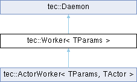
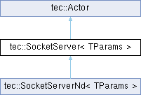
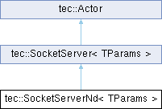

# TEC: Header-Only, Template-Based C++ Library for Multithreaded Execution in Concurrent Environments


## Contents

- [Introduction](#introduction)
  - [Why C++17](#why-c17)
- [Core Abstractions](#core-abstractions)
  - [Daemon](#daemon)
  - [Worker](#worker)
    - [Example 1.1 Common Header](#example-testworker-common-header)
    - [Example 1.2 TestWorker](#example-testworker-implementation)
    - [Example 1.3 Run TestWorker as Daemon](#example-run-testworker)
  - [Actor](#actor)
    - [Example 2.1 Actor Implementation](#example-actor-implementation)
  - [ActorWorker](#actorworker)
- [General Purpose Building Blocks](#general-purpose-building-blocks)
  - [NetData](#netdata)
    - [Example 3.1 Test Data Definitions](#example-netdata-definitions)
    - [Example 3.2 The Use of NetData](#example-the-use-of-netdata)
      - [Example 3.2a](#netdata-dump)
  - [BSD Socket Wrappers](#bsd-socket-wrappers)
- [Networking Layer](#networking-layer)
  - [SocketServer](#socketserver)
    - [Example 4.1 TCP echo server](#example-tcp-echo-server)
  - [SocketClient](#socketclient)
    - [Example 5.1 Socket Client](#example-socket-client)
  - [SocketServerNd](#socketservernd)
    - [Example 6.1 NetData Server](#example-netdata-server)
  - [SocketClientNd](#socketclientnd)
    - [Example 7.1 NetData Client](#example-netdata-client)
- [Test Results](#test-results)
- [Additional Utilities](#additional-utilities)
- [gRPC](#grpc)
  - [Motivation](#motivation)
  - [GrpcServerParams](#grpcserverparams)
  - [GrpcClientParams](#grpcclientparams)
  - [GrpcServer](#grpcserver)
    - [Example 8.1 GrpcServer Declarations](#example-grpcserver-declarations)
    - [Example 8.2 GrpcServer Implementation](#example-grpcserver-implementation)
    - [Example 8.3 Run GrpcServer](#example-run-grpcserver)
  - [GrpcClient](#grpcclient)
    - [Example 9.1 GrpcClient Declarations](#example-grpcclient-declarations)
    - [Example 9.2 GrpcClient Implementation](#example-grpcclient-implementation)
    - [Example 9.3 Run GrpcClient](#example-run-grpcclient)
- [LICENSE](#license)
- [NOTICE](#notice)


## Introduction

The TEC library is a lightweight and fast C++ framework designed for
efficient performance in resource-constrained environments. It is
entirely **header-only** and **template-based**, allowing seamless
integration without additional compilation steps or external
dependencies. The library enables safe, efficient execution
in multithreaded and concurrent systems.

The library is highly extendable, with most members being virtual to
facilitate customization through inheritance and overriding. It
includes robust multithreading support to handle concurrent operations
safely and efficiently.

Additionally, TEC provides a lightweight *binary serialization*
mechanism for compact data packing and unpacking, ideal for network
transmission or storage.

It also features a platform-independent, *BSD socket-based* networking
toolkit that enables cross-platform socket communication without
platform-specific code.

Note that TEC has **no external dependencies** (the use of *gRPC* and
*Zlib* is optional), ensuring it can be dropped into any project without
requiring third-party libraries or tools.

### Why C++17

Historically, TEC targets C++17 because it matches the current minimum
supported standard of gRPC's official C++ implementation. The TEC
library deliberately avoids C++20+ features (concepts, modules,
ranges, std::format, etc.) to maximize compatibility.

For missing standard library utilities (e.g. `std::format`,
`std::print`), TEC provides very simple replacements such as:
`tec::format`, `tec::print`, `tec::println`
(see [tec_print.hpp](https://olddeuteronomy.github.io/tec/html/tec__print_8hpp.html) for more details).

You can still compile TEC with C++20 or C++23 compilers — the library
remains fully header-only and template-based, so it adapts to
newer language features when you use them in your own code.


## Core Abstractions

While TEC was born to improve [gRPC](#grpc) ergonomics, its
*abstractions* turned out to be very useful in many other multithreaded
contexts.

TEC provides a small but powerful set of cooperating class templates
that model different concurrency and service patterns.


### Daemon

`Daemon` is an **abstract base interface** that defines the
minimal contract for any long-lived service or processing component.

A daemon is a process or thread that runs continuously in the
background and handles periodic service messages and requests. This
interface defines the minimum set of methods and signals that a
derived class must implement, including starting, terminating, sending
messages, requests (RPC-style communication), and signaling state changes.

- `run` --- initiates the daemon's background process or thread.
- `terminate` --- stops the daemon's background process or thread.
- `send` --- allows external components to send a message to
  the daemon for processing.
- `make_request` --- sends a request and **waits**
  for a reply in a daemon process/thread (RPC-style communication).

```cpp
// tec_daemon.hpp

#include "tec/tec_status.hpp"
#include "tec/tec_message.hpp"
#include "tec/tec_signal.hpp"

class Daemon {
public:
    // Ctors/dtor are omitted for clarity and conciseness.

    virtual Status run() = 0;
    virtual Status terminate() = 0;

    virtual const Signal& sig_running() const = 0;
    virtual const Signal& sig_inited() const = 0;
    virtual const Signal& sig_terminated() const = 0;

    virtual void send(Message&& msg) = 0
    virtual Status make_request(Request&&, Reply&&) = 0;

    template <typename TRequest, typename TReply>
    Status request(const TRequest* req, TReply* rep) {
        return make_request({req}, {rep});
    }

    template <typename Derived>
    struct Builder {
        std::unique_ptr<Daemon> operator()(typename Derived::Params const& params) {
            static_assert(std::is_base_of<Daemon, Derived>::value,
                          "Derived type must inherit from tec::Daemon");
            return std::make_unique<Derived>(params);
        }
    };
};
```
See the complete definition of [Daemon](https://olddeuteronomy.github.io/tec/html/classtec_1_1Daemon.html).

See also

- [Message/Request/Reply](https://olddeuteronomy.github.io/tec/html/tec__message_8hpp.html),
- [Status](https://olddeuteronomy.github.io/tec/html/structtec_1_1TStatus.html),
- [Signal](https://olddeuteronomy.github.io/tec/html/classtec_1_1Signal.html).

Most higher-level classes in TEC implement or compose `Daemon`.


### Worker

`Worker` is a ready-to-use synchronous message-processing daemon.

<p align="center"></p>

Implements the Daemon interface to manage a worker thread that
processes messages from a [SafeQueue](https://olddeuteronomy.github.io/tec/html/classtec_1_1SafeQueue.html).
It supports registering callbacks for specific message types, provides
default initialization and exit callbacks, and manages thread
lifecycle with signals for running, initialization, and termination.

Key features:

- Processes messages sequentially in a dedicated thread
- Simple, predictable execution model
- Often used as a building block inside more complex components

Extends [Daemon](https://olddeuteronomy.github.io/tec/html/classtec_1_1Daemon.html) with:

- `register_callback` --- supports registering callbacks
- `on_init` --- initialization (may start threads, open resources, etc.)
- `on_exit` --- graceful shutdown

See the complete definition of [Worker](https://olddeuteronomy.github.io/tec/html/classtec_1_1Worker.html).

See also:

- [Daemon](https://olddeuteronomy.github.io/tec/html/classtec_1_1Daemon.html)
- [SafeQueue](https://olddeuteronomy.github.io/tec/html/classtec_1_1SafeQueue.html).

#### Example: TestWorker Common Header
```cpp
// worker.hpp

#include "tec/tec_daemon.hpp"

// Worker parameters.
struct TestParams {
    // Add custom parameters.
};

// A compound message.
struct Position {
    int x;
    int y;
};

// Reference to the actual Worker implementation exposed as Daemon.
std::unique_ptr<tec::Daemon> create_test_worker(const TestParams&);
```

#### Example: TestWorker Implementation
```cpp
// worker.cpp

#include "tec/tec_worker.hpp"
#include "worker.hpp"

class TestWorker final: public tec::Worker<TestParams> {
public:
    explicit TestWorker(const TestParams& params)
        : tec::Worker<TestParams>(params)
    {
        // Register callbacks.
        register_callback<TestWorker, int>(this,
            &TestWorker::process_int);
        register_callback<TestWorker, std::string>(this,
            &TestWorker::process_string);
        register_callback<TestWorker, Position>(this,
            &TestWorker::process_position);
    }

protected:
    // Override if you need specific initialization.
    // Returns tec::Error::Kind::Ok by default.
    // Status on_init() override { ... }

    // Override if you need specific exiting.
    // Returns tec::Error::Kind::Ok by default.
    // Status on_exit() override { ...  }

    // Process `int` message.
    virtual void process_int(const tec::Message& msg) {
        const int counter = std::any_cast<int>(msg);
        // Do something with `counter`...
    }

    // Process `std::string` message.
    virtual void process_string(const tec::Message& msg) {
        auto str = std::any_cast<std::string>(msg);
        // Do something with `str`...
    }

    // Process `Position` message.
    virtual void process_position(const tec::Message& msg) {
        auto pos = std::any_cast<Position>(msg);
        // Do something with `pos.x` and `pos.y`...
    }
};

//~~~~~~~~~~~~~~~~~~~~~~~~~~~~~~~~~~~~~~~~~~~~~~~
//~~~~~~~~~~~~~~~~~~~~~~~~~~~~~~~~~~~~~~~~~~~~~~~
// Expose actual Worker implementation as Daemon.
//~~~~~~~~~~~~~~~~~~~~~~~~~~~~~~~~~~~~~~~~~~~~~~~
//~~~~~~~~~~~~~~~~~~~~~~~~~~~~~~~~~~~~~~~~~~~~~~~
std::unique_ptr<tec::Daemon> create_test_worker(const TestParams& params)  {
    auto daemon{tec::Daemon::Builder<TestWorker>{}(params)};
    return daemon;
}
```

#### Example: Run TestWorker

Key points:

- The actual TestWorker implementation is **decoupled** from the application code.
- The compilation units `worker.cpp` and `run_test_worker.cpp` are **independent**.

```cpp
// run_test_worker.cpp

#include "tec/tec_daemon.hpp"
#include "worker.hpp"

tec::Status run_test_worker() {
    TestParams params{/*...*/};

    // Create a daemon.
    auto daemon = create_test_worker(params);

    // Start the daemon thread and check for an initialization error.
    auto status = daemon->run();
    if( !status ) {
        return status;
    }

    // Send different messages.

    // `process_int` will be called in the Worker's thread.
    daemon->send({7});
    // `process_string` will be called in the Worker's thread.
    daemon->send({std::string("This is a string!")});
    // `process_position` will be called in the Worker's thread.
    daemon->send({Position{2034, 710}});

    // Optional --- if we want to check an exit status.
    return daemon->terminate();
}
```

See [test_worker.cpp](https://github.com/olddeuteronomy/tec/blob/main/samples/worker/test_worker.cpp)
source code example.


### Actor

`Actor` models an **asynchronous service** with clear lifecycle
(`start`/`shutdown`) and **request-reply** semantics. `Actor` serves
as the foundation for all actor implementations in the TEC framework.

<p align="center"></p>

- Runs its main loop in background thread(s)
- Processes incoming requests via `process_request(...)`
- Ideal for stateful services, background workers, long-running computations

```cpp
class Actor {
public:
    // Ctors/dtor are omitted for clarity and conciseness.

    virtual void start(Signal* sig_started, Status* status) = 0;
    virtual void shutdown(Signal* sig_stopped) = 0;

    virtual Status process_request(Request request, Reply reply) = 0;

}; // class Actor
```

See the complete definition of [Actor](https://olddeuteronomy.github.io/tec/html/classtec_1_1Actor.html).

All concrete actors must inherit from this class and implement:

- `start` –-- asynchronous initialization with completion signal.
- `shutdown` –-- graceful termination with completion signal.
- `process_request` –-- core message handling logic.

Actors are typically long-lived services (e.g., TCP and gRPC servers)
that run in their own thread or event loop until explicitly shut down.

#### Example: Actor implementation
```cpp
// Server parameters.
struct ServerParams {
    int inc;
};


// Implement the Server as an Actor.
class Server final: public tec::Actor {
private:
    ServerParams params_;

public:
    Server(const ServerParams& params)
        : tec::Actor()
        , params_{params}
    {}

    void start(tec::Signal* sig_started, tec::Status* status) override {
        // Does nothing, just set `sig_started` on exit.
        tec::Signal::OnExit on_exit{sig_started};
        tec::println("Server started with {} ...", *status);
    }

    void shutdown(tec::Signal* sig_stopped) override {
        // Does nothing, just set `sig_stopped` on exit.
        tec::Signal::OnExit on_exit{sig_stopped};
        tec::println("Server stopped.");
    }

    //
    // RPC-style request handler. Increments input character by ServerParams::inc
    //
    tec::Status process_request(tec::Request _request, tec::Reply _reply) override {
        // Check type match.
        // NOTE: Both `_request` and `_reply` contain *pointers* to input/output data.
        // NOTE: `_request` content is const!
        if( _request.type() != typeid(const ChrRequest*) ||
            _reply.type() != typeid(ChrReply*) ) {
            return {tec::Error::Kind::Unsupported};
        }

        // Get pointers to actual data.
        auto request = std::any_cast<const ChrRequest*>(_request);
        auto reply = std::any_cast<ChrReply*>(_reply);

        // Increment a character.
        reply->ch = request->ch + params().inc;

        // OK
        return {};
    }
};
```

### ActorWorker

`ActorWorker` combines the **actor model** (asynchronous lifecycle)
with the **worker model** (synchronous RPC request handling via `Daemon`
interface).

<p align="center"></p>

- Starts the underlying `Actor` in a background thread during `on_init()`
- Forwards incoming `Payload` messages to `Actor::process_request()`
- Guarantees thread-safe, synchronous replies back to callers
- Performs clean shutdown of the actor during `on_exit()`

It bridges the asynchronous `Actor` interface with the synchronous
`Worker`/`Daemon` model.

See the complete definition of [ActorWorker](https://olddeuteronomy.github.io/tec/html/classtec_1_1ActorWorker.html).

```cpp
// tec_actor_worker.hpp

template <typename TParams, typename TActor>
class ActorWorker : public Worker<TParams> {
protected:
    // Owned actor instance.
    std::unique_ptr<TActor> actor_;

private:
    // Thread in which the actor runs.
    std::thread actor_thread_;

    // Internals.
    Signal sig_started_;
    Signal sig_stopped_;
    Status status_started_;
    Status status_stopped_;
    std::mutex mtx_request_;

public:
    // Takes ownership of a fully constructed `TActor` instance.
    // Registers a callback to handle `Payload*` messages synchronously.
    ActorWorker(const Params& params, std::unique_ptr<TActor> actor)
        : Worker<Params>(params)
        , actor_{std::move(actor)}
    {
        static_assert(
            std::is_base_of_v<Actor, TActor>,
            "ActorWorker::TActor must derive from tec::Actor");
        // Register synchronous RPC request handler.
        this->template register_callback<ActorWorker, Payload*>(
            this, &ActorWorker::on_request);
    }

    ~ActorWorker() override {
        if (actor_thread_.joinable()) {
            actor_thread_.join();
        }
    }

    // Initializes the worker by starting the actor in a background thread.
    Status on_init() override {
        if (actor_thread_.joinable()) {
            return {"Actor is already running", Error::Kind::RuntimeErr};
        }
        // Launch Actor in dedicated thread.
        actor_thread_ = std::thread([this] {
            actor_->start(&sig_started_, &status_started_);
        });
        // Block until startup completes.
        sig_started_.wait();
        return status_started_;
    }

    // Initiates shutdown in a temporary thread to avoid deadlock if the actor
    // is blocked in `start()`. Waits for `sig_stopped_` and joins both threads.
    Status on_exit() override {
        if (!actor_thread_.joinable()) {
            return {}; // Already stopped
        }
        // Launch Actor's shutdown in a separate thread.
        std::thread shutdown_thread([this] {
            actor_->shutdown(&sig_stopped_);
        });
        sig_stopped_.wait();
        shutdown_thread.join();
        actor_thread_.join();
        return {};
    }

    // Handles incoming `Payload` requests synchronously.
    //
    // Called by the daemon when a message of type `Payload*` arrives.
    // Forwards the request to the actor and populates the reply.
    virtual void on_request(const Message& msg) {
        typename Worker<TParams>::Lock lk{mtx_request_};
        Signal::OnExit on_exit(payload->ready);
        // Dispatch Payload
        auto payload = std::any_cast<Payload*>(msg);
        *(payload->status) = actor_->process_request(
            std::move(payload->request),
            std::move(payload->reply));
    }

```

This is one of the most commonly used building blocks when integrating
TEC with TCP, gRPC, and other services.

See also

- [Payload](https://olddeuteronomy.github.io/tec/html/structtec_1_1Payload.html)
- [Actor](https://olddeuteronomy.github.io/tec/html/classtec_1_1Actor.html)
- [Worker](https://olddeuteronomy.github.io/tec/html/classtec_1_1Worker.html)
- [Daemon](https://olddeuteronomy.github.io/tec/html/classtec_1_1Daemon.html)

See [test_server.cpp](https://github.com/olddeuteronomy/tec/blob/main/samples/worker/test_server.cpp)
source code example.


## General Purpose Building Blocks

### NetData

`NetData` provides efficient serialization and deserialization of
various C++ types including scalars, strings, blobs, containers, maps and
user-defined serializable objects. The format consists of ElemHeader +
payload for each element, allowing flexible and relatively compact
binary representation suitable for network transmission.

<p align="center"></p>

Key features:

- Compact wire format
- No external dependencies
- Supports strings, blobs, containers, POD types, custom structs via specialization
- Very low overhead compared to protobuf / JSON for simple structs

See the complete definition of [NetData](https://olddeuteronomy.github.io/tec/html/classtec_1_1NetData.html).

See also

- [NdTypes](https://olddeuteronomy.github.io/tec/html/structtec_1_1NdTypes.html) -- core type
  definitions and metadata for the NetData binary serialization format.

#### Example: NetData Definitions

```cpp
// samples/test_data.hpp

#include <list>
#include <unordered_map>

#include "tec/tec_serialize.hpp"
#include "tec/tec_json.hpp"
#include "tec/net/tec_net_data.hpp"


namespace test {

constexpr const char test_blob[]{
    "\x01\x02\x03\x04\x05\x06\x07\x08\x09\x0A\x0B\x0C\x0D\x0F"
    "ABCDEFGHIJKLMNOPQRSTUVWXYZabcdefghijklmnopqrstuvwxyz0123456789+/\0"
};

constexpr const char test_string[]{
    "This is a UTF-8 string: 😀 Hello world!\0"
};

/*~~~~~~~~~~~~~~~~~~~~~~~~~~~~~~~~~~~~~~~~~~~~~~~~~~~~~~~~~~~~~~~~~~~~~~
*                             Persons
 *~~~~~~~~~~~~~~~~~~~~~~~~~~~~~~~~~~~~~~~~~~~~~~~~~~~~~~~~~~~~~~~~~~~~*/

struct Person: tec::Serializable, tec::JsonSerializable {
    using json = tec::Json;
    static constexpr const char* sep{tec::Json::sep};

    Person() {}
    Person(short _age, const char* _name, const char* _surname)
        : age{_age}
        , name{_name}
        , surname{_surname}
    {}

    // Data section.
    short age;
    std::string name;
    std::string surname;

    tec::NetData& store(tec::NetData& nd) const override {
        nd
            << age
            << name
            << surname
            ;
        return nd;
    }

    tec::NetData& load(tec::NetData& nd) override {
        nd
            >> age
            >> name
            >> surname
            ;
        return nd;
    }

    friend std::ostream& operator << (std::ostream& os, const Person& p) {
        return os << json{}(p);
    }

    std::string to_json() const override {
        std::ostringstream os;
        os
            << json{}(age, "age") << sep
            << json{}(name, "name") << sep
            << json{}(surname, "surname")
            ;
        return os.str();
    }
};

/*~~~~~~~~~~~~~~~~~~~~~~~~~~~~~~~~~~~~~~~~~~~~~~~~~~~~~~~~~~~~~~~~~~~~~~
*          TestData (covers almost all serializable types)
 *~~~~~~~~~~~~~~~~~~~~~~~~~~~~~~~~~~~~~~~~~~~~~~~~~~~~~~~~~~~~~~~~~~~~*/

struct TestData: tec::NdRoot, tec::JsonSerializable {
    using json = tec::Json;
    static constexpr auto sep{tec::Json::sep};

    // Data section.
    std::list<int> list;
    short i16;
    int i32;
    unsigned long long u64;
    std::string str;
    float f32;
    double d64;
    Person p;
    long double d128;
    tec::Blob blob;
    bool b;
    std::unordered_map<int, Person> map;

    TestData(): tec::NdRoot(0) {
        i16 = 0;
        i32 = 0;
        u64 = 0.0;
        f32 = 0.0f;
        d64 = 0.0;
        d128 = 0.0;
        b = false;
    }

    inline static void init(TestData& d) {
        // Fill test data.
        std::unordered_map<int,Person>
            persons{
            {1256, {31, "Mary", "Smith"}},
            {78, {39, "Harry", "Long"}},
            {375, {67, "Kevin", "Longsdale"}},
        };

        d.list = {1, 2, 3, 4};
        d.i16 = 16;
        d.i32 = 32;
        d.u64 = 1767623391515;
        d.str = test_string;
        d.f32 = 3.14f;
        d.d64 = 2.78;
        d.p = {61, "John", "Dow"};
        d.d128 = 1.123456e102;
        d.blob = {test_blob, strlen(test_blob)};
        d.b = true;
        d.map = persons;
    }

    tec::NetData& store(tec::NetData& nd) const override {
      nd
          << list
          << i16
          << i32
          << u64
          << str
          << f32
          << d64
          << p
          << d128
          << blob
          << b
          << map
          ;
      return nd;
    }

    tec::NetData& load(tec::NetData& nd) override {
        nd
            >> list
            >> i16
            >> i32
            >> u64
            >> str
            >> f32
            >> d64
            >> p
            >> d128
            >> blob
            >> b
            >> map
            ;
        return nd;
    }

    friend std::ostream& operator << (std::ostream& os, const TestData& p) {
        return os << tec::Json{}(p);
    }

    std::string to_json() const override {
        std::ostringstream os;
        os
            << json{}(list, "list") << sep
            << json{}(i16, "i16") << sep
            << json{}(i32, "i32") << sep
            << json{}(u64, "u64") << sep
            << json{}(str, "str") << sep
            << json{}(f32, "f32") << sep
            << json{}(d64, "d64") << sep
            << json{}(p, "person") << sep
            << json{}(d128, "d128") << sep
            << json{}(blob, "bytes") << sep
            << json{}(b, "b") << sep
            << json{}(map, "persons")
            ;
        return os.str();
    }
};

/*~~~~~~~~~~~~~~~~~~~~~~~~~~~~~~~~~~~~~~~~~~~~~~~~~~~~~~~~~~~~~~~~~~~~~~
*                         GetPersons RPC structs
 *~~~~~~~~~~~~~~~~~~~~~~~~~~~~~~~~~~~~~~~~~~~~~~~~~~~~~~~~~~~~~~~~~~~~*/

// Used to register an RPC handler in SocketServerNd.
struct RPCID {
    constexpr static tec::rpcid_t GetPersons{1};
};

//
// Request
//
struct GetPersonsIn: tec::NdRoot, tec::JsonSerializable {
    using json = tec::Json;
    static constexpr auto sep{tec::Json::sep};

    // Input data.
    int max_count;

    GetPersonsIn()
        : tec::NdRoot(RPCID::GetPersons)  // Request ID.
        , max_count{0}       // Get all records.
        {}

    tec::NetData& store(tec::NetData& nd) const override {
        return nd << max_count;
    }

    tec::NetData& load(tec::NetData& nd) override {
        return nd >> max_count;
    }

    friend std::ostream& operator << (std::ostream& os, const GetPersonsIn& p) {
        return os << json{}(p);
    }

    std::string to_json() const override {
        std::ostringstream os;
        os
            << json{}(max_count, "max_count")
            ;
        return os.str();
    }
};

//
// Reply
//
struct GetPersonsOut: tec::NdRoot, tec::JsonSerializable {
    using json = tec::Json;
    static constexpr auto sep{tec::Json::sep};

    // Output data.
    std::list<Person> persons;

    GetPersonsOut()
        : tec::NdRoot(RPCID::GetPersons) // Reply ID MUST BE EQUAL TO Request ID.
    {}

     tec::NetData& store(tec::NetData& nd) const override {
        return nd << persons;
    }

    tec::NetData& load(tec::NetData& nd) override {
        return nd >> persons;
    }

    friend std::ostream& operator << (std::ostream& os, const GetPersonsOut& p) {
        return os << json{}(p);
    }

    std::string to_json() const override {
        std::ostringstream os;
        os
            << json{}(persons, "persons")
            ;
        return os.str();
    }
};

} // namespace test
```

See the complete [example](https://github.com/olddeuteronomy/tec/blob/main/samples/test_data.hpp).


#### Example: The Use of NetData
```cpp
#include <cstdio>
#include <iostream>

#include "tec/tec_dump.hpp"
#include "tec/net/tec_net_data.hpp"
#include "tec/net/tec_nd_compress.hpp"

#include "../test_data.hpp"

void print_data(const test::TestData& data) {
    std::cout << data << "\n";
}

void print_nd(const tec::NetData& nd) {
    std::cout
        << "HEADER ===================================\n"
        << "Magic:   " << std::hex << nd.header.magic << "\n"
        << "Version: " << nd.header.version << std::dec << "\n"
        << "ID:      " << nd.header.id << "\n"
        << "Size:    " << nd.header.size << "\n"
        << "Orig:    " << nd.header.size_uncompressed << "\n"
        << "=========================================\n"
        ;
    std::cout << tec::dump::as_table(nd.bytes().as_hex()) << "\n";
}


int main() {
    test::TestData data;
    test::TestData::init(data);

    // Store data.
    tec::NetData nd_in;
    print_data(data);
    nd_in << data;
    print_nd(nd_in);

    // Compressing. Use `make ... ZLIB=1` to enable Zlib compression.
    tec::NdCompress comp(tec::CompressionParams::kCompressionZlib);
    comp.compress(nd_in);

    //
    // Emulate NetData transferring...
    //
    tec::NetData nd_out;
    nd_out.copy_from(nd_in);
    print_nd(nd_out);

    // Uncompressing. Use `make ... ZLIB=1` to enable Zlib uncompression.
    tec::NdCompress uncomp;
    uncomp.uncompress(nd_out);
    print_nd(nd_out);

    // Restore data.
    test::TestData data_out;
    nd_out.rewind(); // To ensure we're reading from the beginning.
    nd_out >> data_out;
    print_data(data_out);

    return 0;
}
```

See the complete [example](https://github.com/olddeuteronomy/tec/blob/main/samples/net/test_netdata.cpp).

See also:

- [NdCompress](https://olddeuteronomy.github.io/tec/html/classtec_1_1NdCompress.html) --- Compression
  wrapper for NetData objects with pluggable backends.


##### NetData Dump

<pre>
// print_data(const test::TestData& data) --- JSON output.
//
{"list": [1, 2, 3, 4], "i16": 16, "i32": 32, "u64": 1767623391515,
"str": "This is a UTF-8 string: 😀 Hello world!", "f32": 3.14,
"d64": 2.78, "person": {"age": 61, "name": "John", "surname": "Dow"},
"d128": 1.12346e+102,
"bytes": "AQIDBAUGBwgJCgsMDQ9BQkNERUZHSElKS0xNTk9QUVJTVFVWV1hZWmFiY2RlZmdoaWprbG1ub3BxcnN0dXZ3eHl6MDEyMzQ1Njc4OSsv",
"b": true, "persons": {375: {"age": 67, "name": "Kevin", "surname": "Longsdale"},
78: {"age": 39, "name": "Harry", "surname": "Long"},
1256: {"age": 31, "name": "Mary", "surname": "Smith"}}}
//
// print_nd(const tec::NetData& nd) --- header + hex table.
//
HEADER ===================================
Magic:   41b00
Version: 100
ID:      0
Size:    517
Orig:    0
=========================================
offset|00  02  04  06  08  10  12  14  16  18  20  22  24  26  28  30
======|++--++--++--++--++--++--++--++--++--++--++--++--++--++--++--++--|
000000| O00FD0100000100 C00 0000000040003050400000001000100000003050400|
000032|0000010002000000030504000000010003000000030504000000010004000000|
000064|0205020000000100100003050400000001002000000004010800000001001B y|
000096|908E9B010000 A09 )0000000100 T h i s20 i s20 a20 U T F - 820 s t|
000128| r i n g :20F09F988020 H e l l o20 w o r l d !0607040000000100C3|
000160|F5 H @0707080000000100 =0AD7A3 p =06 @ O00 !00000001000205020000|
000192|000100 =00 A09040000000100 J o h n A09030000000100 D o w08071000|
000224|0000010000C8F3 >D3DB h80 R AD7 r02 eAA8D B09 N000000010001020304|
000256|05060708090A0B0C0D0F A B C D E F G H I J K L M N O P Q R S T U V|
000288| W X Y Z a b c d e f g h i j k l m n o p q r s t u v w x y z 0 1|
000320| 2 3 4 5 6 7 8 9 + /050101000000010001 M00AA00000003000305040000|
000352|000100 w010000 O00 (00000001000205020000000100 C00 A090500000001|
000384|00 K e v i n A09090000000100 L o n g s d a l e0305040000000100 N|
000416|000000 O00 #00000001000205020000000100 '00 A09050000000100 H a r|
000448| r y A09040000000100 L o n g0305040000000100E8040000 O00 #000000|
000480|010002050200000001001F00 A09040000000100 M a r y A09050000000100|
000512| S m i t h|
</pre>

See also:

- [JSON](https://olddeuteronomy.github.io/tec/html/structtec_1_1Json.html) --- Utility class for
  generating minimal, valid JSON strings at compile-time and runtime.


### BSD Socket Wrappers

<p align="center"></p>

- [SocketParams](https://olddeuteronomy.github.io/tec/html/structtec_1_1SocketParams.html) --- Common
  parameters used for both client and server socket configuration.

See also

- [SocketServerParams](https://olddeuteronomy.github.io/tec/html/structtec_1_1SocketServerParams.html)
- [SocketClientParams](https://olddeuteronomy.github.io/tec/html/structtec_1_1SocketClientParams.html)

<p align="center"></p>

- [Socket](https://olddeuteronomy.github.io/tec/html/structtec_1_1Socket.html) --- Lightweight wrapper around a connected socket file
  descriptor.
- [SocketNd](https://olddeuteronomy.github.io/tec/html/structtec_1_1SocketNd.html) --- Specialized
  socket wrapper optimized for sending/receiving
  [NetData](https://olddeuteronomy.github.io/tec/html/classtec_1_1NetData.html) protocol messages.


## Networking Layer

### SocketServer
Generic BSD socket server template using actor pattern with configurable parameters.

Supports both single-threaded (synchronous) and multi-threaded (thread-pool) modes.
Implements the *CharStream* mode -- text oriented (default echo server behavior).

<p align="center"></p>

Main responsibilities:

- address resolution & binding
- listening
- accepting connections in a loop
- dispatching client sockets either synchronously or via thread pool
- graceful shutdown with proper socket closure

See the complete definition of [SocketServer](https://olddeuteronomy.github.io/tec/html/classtec_1_1SocketServer.html).

See also:

- [SocketServerNd](https://olddeuteronomy.github.io/tec/html/classtec_1_1SocketServerNd.html) --- a derived
  class implementing the *NetData* mode --- binary protocol oriented.

#### Example: TCP echo server
```cpp
#include <csignal>
#include <sys/socket.h>

#include "tec/tec_print.hpp"
#include "tec/tec_actor_worker.hpp"
#include "tec/net/tec_socket_server.hpp"

/*~~~~~~~~~~~~~~~~~~~~~~~~~~~~~~~~~~~~~~~~~~~~~~~~~~~~~~~~~~~~~~~~~~~~~~
*                     A simplest TCP echo server
*   in the kModeCharStream mode (default, receives and sends strings)
 *~~~~~~~~~~~~~~~~~~~~~~~~~~~~~~~~~~~~~~~~~~~~~~~~~~~~~~~~~~~~~~~~~~~~*/

// Instantiate core blocks.
using TCPParams = tec::SocketServerParams;
using TCPServer = tec::SocketServer<TCPParams>;
using TCPServerWorker = tec::ActorWorker<TCPParams, TCPServer>;

tec::Signal sig_quit;

tec::Status tcp_server() {
    tec::SocketServerParams params;
    // Accepts both IPv4 and IPv6.
    params.addr = tec::SocketParams::kAnyAddrIP6;
    params.family = AF_INET6;
    // To accept IPv4 only:
    // params.addr = tec::SocketParams::kAnyAddr;
    // params.family = AF_INET;
    //
    // Use internal thread pool to process incoming connections.
    // `false` by default.
    params.use_thread_pool = true;

    // Create TCP server as Daemon.
    auto srv{TCPServerWorker::Builder<TCPServerWorker, TCPServer>{}(params)};

    // Run it and check for the result.
    auto status = srv->run();
    if( !status ) {
        tec::println("run(): {}", status);
        return status;
    }

    // Wait for <Ctrl-C> pressed to terminate the server.
    tec::println("\nPRESS <Ctrl-C> TO QUIT THE SERVER");
    sig_quit.wait();

    // Terminate the server
    status = srv->terminate();
    return status;
}

int main() {
    // Install Ctrl-C handler.
    std::signal(SIGINT, [](int){ sig_quit.set(); });
    // Run the server.
    auto result = tcp_server();
    tec::println("\nExited with {}", result);
    return result.code.value_or(0);
}
```

See the complete [example](https://github.com/olddeuteronomy/tec/blob/main/samples/socket/tcp_server.cpp).


### SocketClient

Templated client socket actor for establishing and managing connections.

<p align="center"></p>

The [SocketClient](doc/html/classtec_1_1SocketClient.html) class
provides a mechanism to connect to a server using socket APIs, send
and receive data (primarily strings via SocketCharStreamIn/Out), and
handle actor lifecycle events like start and shutdown. It uses a
template parameter for configuration, ensuring type safety through
static assertion.

Key features:

- Resolves server addresses using getaddrinfo.
- Establishes connections with fallback on multiple address candidates.
- Supports sending and receiving null-terminated strings.
- Provides virtual methods for customization (e.g., socket options, send/receive logic).
- Integrates with Actor for signal-based start/stop and request processing.

See the complete definition of [SocketClient](https://olddeuteronomy.github.io/tec/html/classtec_1_1SocketClient.html).

See also:

- [SocketCharStreamIn](https://olddeuteronomy.github.io/tec/html/structtec_1_1SocketCharStreamIn.html) ---
  Input descriptor for character stream mode.
- [SocketCharStreamOut](https://olddeuteronomy.github.io/tec/html/structtec_1_1SocketCharStreamOut.html) ---
  Output descriptor for character stream mode.


#### Example: Socket Client

```cpp
#include <string>
#include <sys/socket.h>

#include "tec/tec_def.hpp" // IWYU pragma: keep
#include "tec/tec_print.hpp"
#include "tec/tec_actor_worker.hpp"
#include "tec/net/tec_socket_client.hpp"

/*~~~~~~~~~~~~~~~~~~~~~~~~~~~~~~~~~~~~~~~~~~~~~~~~~~~~~~~~~~~~~~~~~~~~~~
*                     A simple TCP client
 *~~~~~~~~~~~~~~~~~~~~~~~~~~~~~~~~~~~~~~~~~~~~~~~~~~~~~~~~~~~~~~~~~~~~*/

// Instantiate core blocks.
using TCPParams = tec::SocketClientParams;
using TCPClient = tec::SocketClient<TCPParams>;
using TCPClientWorker = tec::ActorWorker<TCPParams, TCPClient>;


tec::Status tcp_client() {
    // By default, it can connect to either IPv4 or IPv6 tec::SocketServer.
    TCPParams params;
    // To use IPv6 only (local server):
    //     params.addr = tec::SocketParams::kLocalAddrIP6;
    //     params.family = AF_INET6;
    // To use IPv4 only (local server):
    //     params.addr = tec::SocketParams::kLocalAddr;
    //     params.family = AF_INET4;

    // Using Daemon interface.
    auto cli{TCPClientWorker::Builder<TCPClientWorker, TCPClient>{}(params)};

    // Run it and check for the result.
    auto status = cli->run();
    if( !status ) {
        tec::println("tcp_client: {}", status);
        return status;
    }

    // Data to process.
    std::string str_send{"Hello world!"};
    std::string str_recv;

    // Make an RPC request using the Daemon API.
    tec::SocketCharStreamIn req{&str_send};
    tec::SocketCharStreamOut rep{&str_recv};
    status = cli->request(&req, &rep);

    if( !status ) {
        tec::println("tcp_client: {}", status);
        return status;
    }

    tec::println("SEND:\"{}\"", str_send);
    tec::println("RECV:\"{}\"", str_recv);

    // Optionally.
    cli->terminate();
    return status;
}


int main() {
    // Run the client.
    auto result = tcp_client();

    tec::println("\nExited with {}", result);
    return result.code.value_or(0);
}
```

See the complete [example](https://github.com/olddeuteronomy/tec/blob/main/samples/socket/tcp_client.cpp).


### SocketServerNd

NetData-protocol-aware BSD socket server with request dispatching and optional compression.

<p align="center"></p>

[SocketServerNd](https://olddeuteronomy.github.io/tec/html/classtec_1_1SocketServerNd.html) extends
[SocketServer](https://olddeuteronomy.github.io/tec/html/classtec_1_1SocketServer.html) to handle the
[NetData](https://olddeuteronomy.github.io/tec/html/classtec_1_1NetData.html) message framing protocol
(header + payload) and provides:

- typed handler registration by NetData::ID
- automatic compression/decompression (when enabled in params)
- default echo handler (ID = 0)
- structured error reply mechanism
- fallback to raw string handling when message is not valid NetData

See the complete definition of [SocketServerNd](https://olddeuteronomy.github.io/tec/html/classtec_1_1SocketServerNd.html).

See also:

- [NetData](https://olddeuteronomy.github.io/tec/html/classtec_1_1NetData.html)
- [NdCompress](https://olddeuteronomy.github.io/tec/html/classtec_1_1NdCompress.html)


#### Example: NetData Server

```cpp
#include <csignal>

#include "tec/tec_def.hpp" // IWYU pragma: keep
#include "tec/tec_print.hpp"
#include "tec/tec_trace.hpp"
#include "tec/tec_actor_worker.hpp"
#include "tec/net/tec_net_data.hpp"
#include "tec/net/tec_compression.hpp"
#include "tec/net/tec_socket_server_nd.hpp"

// See Example in the NetData section.
#include "../test_data.hpp"

/*~~~~~~~~~~~~~~~~~~~~~~~~~~~~~~~~~~~~~~~~~~~~~~~~~~~~~~~~~~~~~~~~~~~~~~
*                      NetData TCP server
 *~~~~~~~~~~~~~~~~~~~~~~~~~~~~~~~~~~~~~~~~~~~~~~~~~~~~~~~~~~~~~~~~~~~~*/

using TCPParams = tec::SocketServerParams;
using TCPServer = tec::SocketServerNd<TCPParams>;

using DataInOut = TCPServer::DataInOut;

// Instantiate a server (as Actor).
class Server final: public TCPServer {
public:
    Server(const TCPParams& params)
        : TCPServer(params)
    {
        // Register NetData RPC GetPersons handler. See ../test_data.hpp.
        register_handler(this, test::RPCID::GetPersons, &Server::on_persons);
    }

    virtual void on_persons(DataInOut dio) {
        TEC_ENTER("MyServer::on_persons");
        //
        // Get request. (Not used in this sample.)
        //
        GetPersonsIn request;
        *dio.nd_in >> request;
        //
        // Generate a reply...
        //
        GetPersonsOut reply;
        reply.persons.push_back({67, "John", "Dow"});
        reply.persons.push_back({52, "Boris", "Applegate"});
        reply.persons.push_back({29, "Lucy", "Skywalker"});
        reply.persons.push_back({20, "Harry", "Long"});
        //
        // ... and send it back to a client.
        //
        *dio.nd_out << reply;
    }
};

// Instantiate an ActorWorker.
using TCPServerWorker = tec::ActorWorker<TCPParams, Server>;

/*~~~~~~~~~~~~~~~~~~~~~~~~~~~~~~~~~~~~~~~~~~~~~~~~~~~~~~~~~~~~~~~~~~~~~~
*                    Create and run the TCP server
 *~~~~~~~~~~~~~~~~~~~~~~~~~~~~~~~~~~~~~~~~~~~~~~~~~~~~~~~~~~~~~~~~~~~~*/

tec::Signal sig_quit;

tec::Status tcp_server() {
    tec::SocketServerParams params;
    // To accept IPv6:
    // params.addr = tec::SocketParams::kAnyAddrIP6;
    // params.family = AF_INET6;
    params.mode = tec::SocketServerParams::kModeNetData;
    params.compression = tec::CompressionParams::kCompressionZlib;
    params.use_thread_pool = true;

    // Create a daemon.
    auto srv{TCPServerWorker::Builder<TCPServerWorker, Server>{}(params)};
    //
    // Run it and check for the result.
    //
    auto status = srv->run();
    if( !status ) {
        tec::println("run(): {}", status);
        return status;
    }
    //
    // Wait for <Ctrl-C> pressed to terminate the server.
    //
    tec::println("\nPRESS <Ctrl-C> TO QUIT THE SERVER");
    sig_quit.wait();
    //
    // Terminate the server (optionally).
    //
    status = srv->terminate();
    return status;
}

/*~~~~~~~~~~~~~~~~~~~~~~~~~~~~~~~~~~~~~~~~~~~~~~~~~~~~~~~~~~~~~~~~~~~~~~
*                             MAIN
 *~~~~~~~~~~~~~~~~~~~~~~~~~~~~~~~~~~~~~~~~~~~~~~~~~~~~~~~~~~~~~~~~~~~~*/

int main() {
    // Install Ctrl-C handler.
    std::signal(SIGINT, [](int){ sig_quit.set(); });

    // Run the test.
    auto result = tcp_server();

    tec::println("\nExited with {}", result);
    return result.code.value_or(0);
}
```

See the complete [example](https://github.com/olddeuteronomy/tec/blob/main/samples/socket/tcp_server_nd.cpp).

See also:

- [DataInOut](https://olddeuteronomy.github.io/tec/html/structtec_1_1SocketServerNd_1_1DataInOut.html)


### SocketClientNd

Templated client socket [Actor](https://olddeuteronomy.github.io/tec/html/classtec_1_1Actor.html) for
[NetData](https://olddeuteronomy.github.io/tec/html/classtec_1_1NetData.html) stream handling.

<p align="center"></p>

The [SocketClientNd](https://olddeuteronomy.github.io/tec/html/classtec_1_1SocketClientNd.html) class extends
[SocketClient](https://olddeuteronomy.github.io/tec/html/classtec_1_1SocketClient.html) to support
NetData-based requests and replies. It handles binary data
transmission with optional compression, providing overrides for
request processing and virtual methods for send/receive and data
processing customization.

Key features:

- Processes
  [NetData::StreamIn](doc/html/structtec_1_1NetData_1_1StreamIn.html)
  and
  [NetData::StreamOut](doc/html/structtec_1_1NetData_1_1StreamOut.html)
  for structured data exchange.
- Supports compression/uncompression based on parameters.
- Integrates with [SocketNd](https://olddeuteronomy.github.io/tec/html/structtec_1_1SocketNd.html) for
  low-level NetData socket operations.

See the complete documentation of [SocketClientNd](https://olddeuteronomy.github.io/tec/html/classtec_1_1SocketClientNd.html).

See also:

- [NetData](https://olddeuteronomy.github.io/tec/html/classtec_1_1NetData.html)
- [NdCompress](https://olddeuteronomy.github.io/tec/html/classtec_1_1NdCompress.html)


#### Example: NetData Client

```cpp
#include <memory>
#include <string>
#include <sys/socket.h>

#include "tec/tec_def.hpp" // IWYU pragma: keep
#include "tec/tec_print.hpp"
#include "tec/tec_dump.hpp"
#include "tec/tec_actor_worker.hpp"
#include "tec/net/tec_net_data.hpp"
#include "tec/net/tec_socket_client_nd.hpp"

// See Example in the NetData section.
#include "../test_data.hpp"

/*~~~~~~~~~~~~~~~~~~~~~~~~~~~~~~~~~~~~~~~~~~~~~~~~~~~~~~~~~~~~~~~~~~~~~~
*                       NetData TCP client
 *~~~~~~~~~~~~~~~~~~~~~~~~~~~~~~~~~~~~~~~~~~~~~~~~~~~~~~~~~~~~~~~~~~~~*/

// Instatiate core blocks.
using TCPParams = tec::SocketClientParams;
using TCPClient = tec::SocketClientNd<TCPParams>;
using TCPClientWorker = tec::ActorWorker<TCPParams, TCPClient>;

tec::Status tcp_client() {
    // By default, it can connect to either IPv4 or IPv6 tec::SocketServer.
    TCPParams params;
    params.compression = tec::CompressionParams::kCompressionZlib;
    // To use IPv6 only:
    //     params.addr = tec::SocketParams::kLocalAddrIP6;
    //     params.family = AF_INET6;
    // To use IPv4 only:
    //     params.addr = tec::SocketParams::kLocalAddr;
    //     params.family = AF_INET4;

    // Data to process.
    GetPersonsIn persons_in;
    GetPersonsOut persons_out;

    // Use Daemon interface.
    auto cli{TCPClientWorker::Builder<TCPClientWorker, TCPClient>{}(params)};

    // Run it and check for the result.
    auto status = cli->run();
    if( !status ) {
        tec::println("tcp_client: {}", status);
        return status;
    }

    // Request.
    tec::NetData nd_in;
    // Binary serialization.
    nd_in << persons_in;

    // Reply.
    tec::NetData nd_out;

    // Make an RPC request using the Daemon API.
    tec::NetData::StreamIn req{&nd_in};
    tec::NetData::StreamOut rep{&nd_out};
    status = cli->request(&req, &rep);

    if( !status ) {
        tec::println("tcp_client: {}", status);
        return status;
    }

    // Restore reply via binary deserialization.
    nd_out >> persons_out;

    // Optionally.
    cli->terminate();
    return status;
}

/*~~~~~~~~~~~~~~~~~~~~~~~~~~~~~~~~~~~~~~~~~~~~~~~~~~~~~~~~~~~~~~~~~~~~~~
*                             MAIN
 *~~~~~~~~~~~~~~~~~~~~~~~~~~~~~~~~~~~~~~~~~~~~~~~~~~~~~~~~~~~~~~~~~~~~*/

int main() {
    // Run the test.
    auto result = tcp_client();

    tec::println("\nExited with {}", result);
    return result.code.value_or(0);
}
```

See the complete [example](https://github.com/olddeuteronomy/tec/blob/main/samples/socket/tcp_client_nd.cpp).


## Test Results

Parameters:

- Dell Latitude 7490, i7-8650U × 8, 16 GiB
- Ubuntu 24.04.2
- clang++ v.18.1.3
- Compiler options: -02 -Wall -std=c++17 -pthread
- 6 clients running in parallel.
- Each client sends 5000 requests, 1 request per 50 ms.
- `tcp_server` / `tcp_server_nd`

| Mode       | Compression | Thread Pool | Memory (when idle) | Startup Time |
|------------| :---------: | :---------: | :----------------: | :----------: |
| CharStream | N/A         | Off         | 258 K              | ~1 ms        |
| CharStream | N/A         | 8 threads   | 508 K              | ~1 ms        |
| NetData    | Off         | Off         | 262 K              | ~1 ms        |
| NetData    | Off         | 8 threads   | 578 K              | ~1 ms        |
| NetData    | Zlib        | Off         | 300 K              | ~1 ms        |
| NetData    | Zlib        | 8 threads   | 778 K              | ~1 ms        |


## Additional Utilities

TEC bundles several small utilities and helpers:

- [tec_base64.hpp](https://olddeuteronomy.github.io/tec/html/tec__base64_8hpp.html) --- A header-only Base64 encoder/decoder.
- [tec_container.hpp](https://olddeuteronomy.github.io/tec/html/tec__container_8hpp.html) -- Generic container and map traits.
- [tec_dump.hpp](https://olddeuteronomy.github.io/tec/html/tec__dump_8hpp.html) --- Debugging/inspecting helpers.
- [tec_guid.hpp](https://olddeuteronomy.github.io/tec/html/tec__guid_8hpp.html) --- GUID generation utilities.
- [tec_json.hpp](https://olddeuteronomy.github.io/tec/html/tec__json_8hpp.html) --- Simple JSON serialization.
- [tec_memfile.hpp](https://olddeuteronomy.github.io/tec/html/tec__memfile_8hpp.html) --- A byte buffer class with stream-like read/write semantics.
- [tec_message.hpp](https://olddeuteronomy.github.io/tec/html/tec__message_8hpp.html) --- Defines a flexible message type and helper functions.
- [tec_print.hpp](https://olddeuteronomy.github.io/tec/html/tec__print_8hpp.html) --- Provides variadic print and format utilities.
- [tec_queue.hpp](https://olddeuteronomy.github.io/tec/html/tec__queue_8hpp.html) --- Thread-safe queue implementation.
- [tec_serialize.hpp](https://olddeuteronomy.github.io/tec/html/tec__serialize_8hpp.html) --- he base interface for serializable objects.
- [tec_signal.hpp](https://olddeuteronomy.github.io/tec/html/tec__signal_8hpp.html) --- Defines a thread-safe signal implementation using mutex and condition variable.
- [tec_status.hpp](https://olddeuteronomy.github.io/tec/html/tec__status_8hpp.html) --- Defines error handling types and utilities.
- [tec_thread_pool.hpp](https://olddeuteronomy.github.io/tec/html/tec__thread__pool_8hpp.html) --- Simple, non-stealing thread pool implementation using a single shared task queue.
- [tec_timestamp.hpp](https://olddeuteronomy.github.io/tec/html/tec__timestamp_8hpp.html) --- A point in time since UNIX epoch.
- [tec_trace.hpp](https://olddeuteronomy.github.io/tec/html/tec__trace_8hpp.html) --- Provides a thread-safe tracing utility for debugging.
- [tec_utils.hpp](https://olddeuteronomy.github.io/tec/html/tec__utils_8hpp.html) --- Provides time-related utilities and system information functions.
- [net/tec_nd_compress.hpp](https://olddeuteronomy.github.io/tec/html/tec__nd__compress_8hpp.html) --- Compression wrapper for NetData objects with pluggable backends.


## gRPC

Historically, the TEC library was originally created to make working
with gRPC servers and clients cleaner, more modular, and much less
verbose.

### Motivation

[gRPC](https://grpc.io/) is a powerful and performant RPC framework, but its generated
code and service implementation tend to tightly couple business logic
with gRPC-specific headers, stubs, completion queues, and low-level
details. This leads to:

- Heavy include-graph dependencies across the project
- Slower compilation times
- Difficult testing and mocking of services
- Reduced reusability of business logic outside gRPC contexts

TEC was created to solve exactly these problems by introducing a clean
**abstraction layer**:

- Decouples **gRPC implementation details** from your application code
- Hides gRPC headers from most compilation units
- Provides a universal, minimal interface for sending/receiving messages and requests
- Enables fast compilation and better separation of concerns
- Remains platform-independent and easily extensible

The result is a small set of **template-based** abstractions that can
be used both with gRPC and in many other multithreaded scenarios (TCP
servers/clients, message queues, background workers, etc.).


### GrpcServerParams

Configuration parameters for gRPC server instances.

See the complete documentation of [GrpcServerParams](https://olddeuteronomy.github.io/tec/html/structtec_1_1GrpcServerParams.html).


### GrpcClientParams

Configuration parameters for gRPC client instances.

Defines default timeouts and configuration options for gRPC client operations.

See the complete documentation of [GrpcClientParams](https://olddeuteronomy.github.io/tec/html/structtec_1_1GrpcClientParams.html).


### GrpcServer

Base class for actor-style gRPC servers. Declares a generic,
actor-based gRPC server template that can be specialized for different
gRPC services via template parameters.

<p align="center"></p>

Provides common infrastructure for:

- configuring server builder (message size limits, compression)
- enabling optional features (health checking, reflection)
- starting a listening server with timeout-protected startup
- graceful shutdown

Concrete servers should inherit from this class and implement
`process_request()` if synchronous request handling is needed, or
override `start()` / use async service registration patterns.

See the complete documentation of [GrpcServer](https://olddeuteronomy.github.io/tec/html/classtec_1_1GrpcServer.html).

See also:

- [Actor](https://olddeuteronomy.github.io/tec/html/classtec_1_1Actor.html)
- [GrpcServerParams](https://olddeuteronomy.github.io/tec/html/structtec_1_1GrpcServerParams.html)


#### Example: GrpcServer Declarations

Key points:

- gRPC headers are not in use.

```cpp
// samples/grpc/server.hpp

#pragma once

#include "tec/tec_daemon.hpp"
#include "tec/grpc/tec_grpc.hpp"

// Instantiate gRPC server parameters.
struct ServerParams: public tec::GrpcServerParams {
    // You can add custom parameters here.
};

// GrpcServer builder -- implemented in server.cpp
std::unique_ptr<tec::Daemon> build_server(const ServerParams& _params);
```

See the complete [example](https://github.com/olddeuteronomy/tec/blob/main/samples/grpc/server.hpp).


#### Example: GrpcServer Implementation

```cpp
// samples/grpc/server.cpp

// stdlib++
#include <memory>
#include <csignal>
#include <string>

// gRPC headers.
#include <grpc/compression.h>
#include <grpcpp/grpcpp.h>
#include <grpcpp/ext/proto_server_reflection_plugin.h>
#include <grpcpp/health_check_service_interface.h>

// Protobuf generated.
#include "helloworld.grpc.pb.h"
#include "helloworld.pb.h"

// TEC
#include "tec/tec_print.hpp"
#include "tec/tec_daemon.hpp"
#include "tec/tec_actor_worker.hpp"
#include "tec/grpc/tec_grpc.hpp"
#include "tec/grpc/tec_grpc_server.hpp"

#include "server.hpp"

using grpc::Status;
using grpc::ServerContext;
using helloworld::Greeter;
using helloworld::HelloReply;
using helloworld::HelloRequest;

/*~~~~~~~~~~~~~~~~~~~~~~~~~~~~~~~~~~~~~~~~~~~~~~~~~~~~~~~~~~~~~~~~~~~~~~
*                        Implement gRPC Service
 *~~~~~~~~~~~~~~~~~~~~~~~~~~~~~~~~~~~~~~~~~~~~~~~~~~~~~~~~~~~~~~~~~~~~*/

static int count{0};

// Implement gRPC service -- logic and data behind the server's behavior.
class TestService final : public Greeter::Service {

    // Prefixing `request` with "Hello".
    Status SayHello(ServerContext *context, const HelloRequest *request, HelloReply *reply) override {
        count += 1;
        tec::println("\nREQUEST #{}: <- \"{}\"", count, request->name());
        // Set reply.
        reply->set_message("Hello " + request->name() + "!");
        // Set metadata.
        tec::add_server_medadata(context, "req_num", std::to_string(count));
        tec::println("REPLY #{}:   -> \"{}\"", count, reply->message());
        return Status::OK;
    }

}; // ::TestService

/*~~~~~~~~~~~~~~~~~~~~~~~~~~~~~~~~~~~~~~~~~~~~~~~~~~~~~~~~~~~~~~~~~~~~~~
*                              Server
 *~~~~~~~~~~~~~~~~~~~~~~~~~~~~~~~~~~~~~~~~~~~~~~~~~~~~~~~~~~~~~~~~~~~~*/

// Instantiate Server traits.
using ServerTraits = tec::grpc_server_traits<
    TestService
    , grpc::Server
    , grpc::ServerBuilder
    , grpc::ServerCredentials
    , grpc_compression_algorithm
    , grpc_compression_level
    >;

// Instantiate gRPC Server.
class Server: public tec::GrpcServer<ServerParams, ServerTraits> {
public:
    Server(const ServerParams& params)
        : tec::GrpcServer<ServerParams, ServerTraits>{params, grpc::InsecureServerCredentials()}
    {}
};

// Instantiate gRPC Server ActorWorker.
using ServerWorker = tec::ActorWorker<ServerParams, Server>;

/*~~~~~~~~~~~~~~~~~~~~~~~~~~~~~~~~~~~~~~~~~~~~~~~~~~~~~~~~~~~~~~~~~~~~~~
*                           Server builder
 *~~~~~~~~~~~~~~~~~~~~~~~~~~~~~~~~~~~~~~~~~~~~~~~~~~~~~~~~~~~~~~~~~~~~*/

std::unique_ptr<tec::Daemon> build_server(const ServerParams& _params) {
    ServerParams params{_params};

    // Set additional gRPC server parameters.
    params.health_check_builder = {&grpc::EnableDefaultHealthCheckService};
    params.reflection_builder = {&grpc::reflection::InitProtoReflectionServerBuilderPlugin};

    return ServerWorker::Builder<ServerWorker, Server>{}(params);
}
```

See the complete [example](https://github.com/olddeuteronomy/tec/blob/main/samples/grpc/server.cpp).


#### Example: Run GrpcServer

Key points:

- gRPC implementation details are decoupled from the application code.
- gRPC headers are not in use.

```cpp
// samples/grpc/test_server.hpp

#include <csignal>

#include "tec/tec_print.hpp"
#include "tec/tec_daemon.hpp"

#include "server.hpp"

tec::Signal sig_quit;

/*~~~~~~~~~~~~~~~~~~~~~~~~~~~~~~~~~~~~~~~~~~~~~~~~~~~~~~~~~~~~~~~~~~~~~~
*                          Run the server
 *~~~~~~~~~~~~~~~~~~~~~~~~~~~~~~~~~~~~~~~~~~~~~~~~~~~~~~~~~~~~~~~~~~~~*/

tec::Status run() {
    // The gRPC daemon.
    ServerParams params;
    auto daemon = build_server(params);

    // Start the daemon.
    tec::println("Starting ...");
    auto status = daemon->run();
    if( !status ) {
        tec::println("Exited abnormally with {}.", status);
        return status;
    }
    tec::println("Server listening on \"{}\"", params.addr_uri);

    // Wait for <Ctrl-C> pressed to terminate the server.
    tec::println("\nPRESS <Ctrl-C> TO QUIT THE SERVER");
    sig_quit.wait();

    // Terminate the server.
    status = daemon->terminate();
    return status;
}

/*~~~~~~~~~~~~~~~~~~~~~~~~~~~~~~~~~~~~~~~~~~~~~~~~~~~~~~~~~~~~~~~~~~~~~~
*                             MAIN
 *~~~~~~~~~~~~~~~~~~~~~~~~~~~~~~~~~~~~~~~~~~~~~~~~~~~~~~~~~~~~~~~~~~~~*/

int main() {
    // Install Ctrl-C handler.
    std::signal(SIGINT, [](int){ sig_quit.set(); });

    auto status = run();

    tec::println("\nExited with {}", status);
    return status.code.value_or(0);
}
```

See the complete [example](https://github.com/olddeuteronomy/tec/blob/main/samples/grpc/test_server.cpp).


### GrpcClient

Base class for actor-style asynchronous gRPC clients.

<p align="center"></p>

Provides common infrastructure for creating and managing a gRPC
channel, configuring message size limits and compression, connecting
with timeout, and creating a service stub.

Concrete clients should inherit from this class and implement
`process_request()` to perform actual RPC calls.

See the complete documentation of [GrpcClient](https://olddeuteronomy.github.io/tec/html/classtec_1_1GrpcClient.html).

See also:

- [Actor](https://olddeuteronomy.github.io/tec/html/classtec_1_1Actor.html)
- [GrpcClientParams](https://olddeuteronomy.github.io/tec/html/structtec_1_1GrpcClientParams.html).

#### Example: GrpcClient Declarations

Key points:

- gRPC headers are not in use.

```cpp
// samples/grpc/client.hpp

#pragma once

#include "tec/tec_daemon.hpp"
#include "tec/grpc/tec_grpc.hpp"

// Instantiate gRPC client parameters.
struct ClientParams: public tec::GrpcClientParams {
    // You can add custom parameters here.
};

// Test request/reply.
struct TestHelloRequest {
    std::string name;
};

struct TestHelloReply {
    std::string message;
};

// Client builder -- implemented in client.cpp
std::unique_ptr<tec::Daemon> build_client(const ClientParams&);
```

See the complete [example](https://github.com/olddeuteronomy/tec/blob/main/samples/grpc/client.hpp).


#### Example: GrpcClient Implementation

```cpp
// samples/grpc/client.cpp

// stdlib++
#include <cstdio>
#include <csignal>
#include <memory>
#include <string>

// gRPC
#include <grpc/compression.h>
#include <grpcpp/grpcpp.h>

// Protobuf generated
#include "helloworld.grpc.pb.h"
#include "helloworld.pb.h"

// TEC
#include "tec/tec_daemon.hpp"
#include "tec/tec_print.hpp"
#include "tec/tec_status.hpp"
#include "tec/tec_message.hpp"
#include "tec/tec_actor_worker.hpp"
#include "tec/grpc/tec_grpc_client.hpp"

#include "client.hpp"

// Instantiate Client traits.
using ClientTraits = tec::grpc_client_traits<
    helloworld::Greeter
    , grpc::Channel
    , grpc::ChannelCredentials
    , grpc::ChannelArguments
    , grpc_compression_algorithm
    >;

// Instantiate a Client.
using BaseClient = tec::GrpcClient<ClientParams, ClientTraits>;

/*~~~~~~~~~~~~~~~~~~~~~~~~~~~~~~~~~~~~~~~~~~~~~~~~~~~~~~~~~~~~~~~~~~~~~~
*                        Client implementation
 *~~~~~~~~~~~~~~~~~~~~~~~~~~~~~~~~~~~~~~~~~~~~~~~~~~~~~~~~~~~~~~~~~~~~*/

class Client final: public BaseClient {
public:
    Client(const ClientParams& params,
           const std::shared_ptr<grpc::ChannelCredentials>& credentials
        )
        : BaseClient(params, {&grpc::CreateCustomChannel}, credentials)
    {}

    tec::Status process_request(tec::Request _request, tec::Reply _reply) override {
        // Check type match.
        // NOTE: *Request* is const!
        // NOTE: Both _request and _reply contain **pointers** to actual data.

        if( _request.type() == typeid(const TestHelloRequest*) &&
            _reply.type() == typeid(TestHelloReply*) ) {
            // Get pointers to actual data.
            auto req = std::any_cast<const TestHelloRequest*>(_request);
            auto rep = std::any_cast<TestHelloReply*>(_reply);
            return make_grpc_request(req, rep);
        }

        return {tec::Error::Kind::Unsupported};
    }

private:
    tec::Status make_grpc_request(const TestHelloRequest* _request, TestHelloReply* _reply) {
        // Data we are sending to the server.
        helloworld::HelloRequest request;
        request.set_name(_request->name);

        // Container for the data we expect from the server.
        helloworld::HelloReply reply;

        // Context for the client. It could be used to convey extra information to
        // the server and/or tweak certain gRPC behavior.
        grpc::ClientContext context;

        // The actual RPC.
        auto status = stub_->SayHello(&context, request, &reply);
        if( !status.ok() ) {
            return {status.error_code(), status.error_message(), tec::Error::Kind::RpcErr};
        }
        // Get server metadata.
        std::string postfix = tec::format(" #{}", tec::get_server_metadata(context, "req_num"));

        // Fill the reply.
        _reply->message = reply.message() + postfix;

        return {};
    }

}; // class Client

/*~~~~~~~~~~~~~~~~~~~~~~~~~~~~~~~~~~~~~~~~~~~~~~~~~~~~~~~~~~~~~~~~~~~~~~
*                         Client Builder
 *~~~~~~~~~~~~~~~~~~~~~~~~~~~~~~~~~~~~~~~~~~~~~~~~~~~~~~~~~~~~~~~~~~~~*/

using ClientWorker = tec::ActorWorker<ClientParams, Client>;

std::unique_ptr<tec::Daemon> build_client(const ClientParams& params) {
    auto actor{std::make_unique<Client>(params, grpc::InsecureChannelCredentials())};
    return std::make_unique<ClientWorker>(params, std::move(actor));
}
```

See the complete [example](https://github.com/olddeuteronomy/tec/blob/main/samples/grpc/client.cpp).


#### Example: Run GrpcClient

Key points:

- gRPC implementation details are decoupled from the application code.
- gRPC headers are not in use.

```cpp
// samples/grpc/test_client.cpp

#include <atomic>
#include <csignal>

#include "tec/tec_print.hpp"

#include "client.hpp"

/*~~~~~~~~~~~~~~~~~~~~~~~~~~~~~~~~~~~~~~~~~~~~~~~~~~~~~~~~~~~~~~~~~~~~~~
*                         MAIN
 *~~~~~~~~~~~~~~~~~~~~~~~~~~~~~~~~~~~~~~~~~~~~~~~~~~~~~~~~~~~~~~~~~~~~*/

std::atomic_bool quit{false};


int main() {
    // Install Ctrl-C handler.
    std::signal(SIGINT, [](int){quit.store(true);});

    // Create a client.
    ClientParams params;
    auto client{build_client(params)};

    // Connect to the server.
    auto result = client->run();
    if( !result ) {
        tec::println("Abnormally exited with {}.", result);
        return result.code.value_or(tec::Error::Code<>::Unspecified);
    }

    // Make requests to the server.
    while( !quit ) {
        // Make a call and print a result.
        TestHelloRequest req{"world"};
        TestHelloReply rep;
        tec::println("{} ->", req.name);
        auto status = client->request<>(&req, &rep);
        if( !status ) {
            tec::println("Error: {}", status);
        }
        else {
            tec::println("<- {}", rep.message);
        }

        tec::println("\nPRESS <Return> TO REPEAT THE REQUEST...");
        tec::println("PRESS <Ctrl-C> THEN <Return> TO QUIT");
        getchar();
    }

    // Clean up.
    result = client->terminate();

    tec::println("Exited with {}.", result);
    return result.code.value_or(0);
}
```

See the complete [example](https://github.com/olddeuteronomy/tec/blob/main/samples/grpc/test_client.cpp).


## Building Samples

The `samples/` directory contains a set of TEC usage examples, with each
subdirectory including a corresponding Makefile.

To force rebuild with `g++` (default, no optimization (`-O0`), w/debug info (`-g`)):
```makefile
make -k -B -j4
```

To force rebuild with `clang++`:
```makefile
make -k -B -j4 CLANG=1
```

To build with the Zlib compression library:
```makefile
make -k -B -j4 ZLIB=1
```

To build a release (`g++`, `-O2`, no debug info)
```makefile
make -k -B -j4 REL=1
```

These `make` flags can be combined:
```makefile
# To build a release with clang++ (-O2, no debug info, linked with Zlib)
make -k -B -j4 CLANG=1 REL=1 ZLIB=1
```


## LICENSE

<pre>
Copyright (C) 2020-2026 The Emacs Cat.

Licensed under the Apache License, Version 2.0 (the "License");
you may not use this file except in compliance with the License.
You may obtain a copy of the License at

  <a href="http://www.apache.org/licenses/LICENSE-2.0">http://www.apache.org/licenses/LICENSE-2.0</a>

Unless required by applicable law or agreed to in writing, software
distributed under the License is distributed on an "AS IS" BASIS,
WITHOUT WARRANTIES OR CONDITIONS OF ANY KIND, either express or implied.
See the License for the specific language governing permissions and
limitations under the License.
</pre>


## NOTICE

### zlib

The following applies if zlib is optionally enabled in the TEC
library's build configuration:

<pre>
Copyright (C) 1995-2024 Jean-loup Gailly and Mark Adler.

Licensed under the zlib License. See the full terms at
<a href="https://zlib.net/zlib_license.html">https://zlib.net/zlib_license.html</a>.
</pre>

### gRPC

The following applies if gRPC is optionally used in the TEC library:

<pre>
Copyright (C) 2014-2023 The gRPC Authors.

Licensed under the Apache License, Version 2.0.
You may obtain a copy at

  <a href="http://www.apache.org/licenses/LICENSE-2.0">http://www.apache.org/licenses/LICENSE-2.0</a>.

See the full license terms at

  <a href="https://github.com/grpc/grpc/blob/master/LICENSE">https://github.com/grpc/grpc/blob/master/LICENSE</a>.

Certain components (e.g., Objective-C podspecs) may use BSD 3-Clause
License (Copyright 2016 Google Inc.), and roots.pem uses Mozilla
Public License 2.0. Consult the full LICENSE for details on
redistribution.
</pre>
